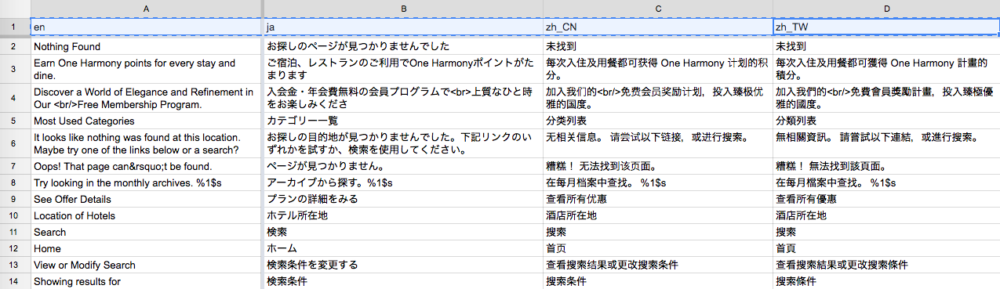

## Setting Configuration

Update config.js file for project settings.
   
   - **LANGUAGE_FOLDER** location

   - **DOCUMENT_ID** for Google Drive Document ID 
      *(Note: row 1 should be set to the language code)*

      

   - **TRANSLATION_FILE** for the filename of the generated csv and json

## Running the script

### Generate PO and MO files of each languages *(without JSON)*
```
npm run lang
```

### Generate PO and MO files of each languages with one **translation JSON**
```
npm run lang json
```